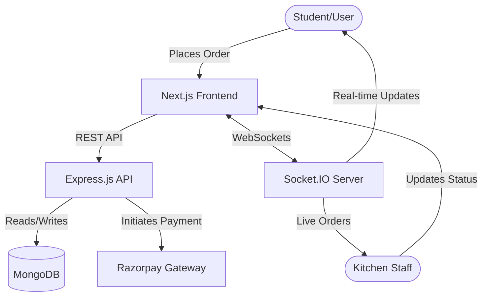

<div align="center">
  
  <h1>CampusBites 🍔</h1>
  <p><strong>A responsive smart canteen ordering system designed for college campuses.</strong></p>
  
  <p>
    <!-- Build & License -->
    <a href="https://github.com/Pxrvn07/CampusBites/actions"></a>
    <a href="https://github.com/Pxrvn07/CampusBites/blob/main/LICENSE"></a>
    <br/>
    <!-- Repository Stats -->
    <a href="https://github.com/Pxrvn07/CampusBites/stargazers"></a>
    <a href="https://github.com/Pxrvn07/CampusBites/network/members"></a>
    <a href="https://github.com/Pxrvn07/CampusBites/issues"></a>
    <a href="https://github.com/Pxrvn07/CampusBites/pulls"></a>
    <a href="https://github.com/Pxrvn07/CampusBites/graphs/contributors"></a>
    <br/>
    <!-- Repository Activity & Size -->
    <a href="https://github.com/Pxrvn07/CampusBites/commits/main"></a>
    <a href="https://github.com/Pxrvn07/CampusBites/commits/main"></a>
    <a href="https://github.com/Pxrvn07/CampusBites"></a>
    <a href="https://github.com/Pxrvn07/CampusBites"></a>
    <a href="https://github.com/Pxrvn07/CampusBites"></a>
    <br/>
    <!-- Tech Stack -->
    
    
    
    
    
    
    
    
    <br/><br/>
    <!-- Visitors -->
    
  </p>
</div>

<hr/>

## 📖 Overview

**CampusBites** completely reimagines the dining experience on college campuses. No more long lines or waiting for tokens. This robust ordering system comes with a modern **Student Portal** to place orders, a **Real-Time KDS** (Kitchen Display System) for chefs, and a comprehensive **Admin Dashboard** to manage operations seamlessly.

Whether you're managing a small cafeteria or a multi-building university dining network, CampusBites provides real-time, instantaneous synchronization to keep everyone updated.

---

## ✨ Features

- **🎓 Student Portal**: Beautiful, responsive Next.js frontend to browse menus, place orders, and track live status with unique tokens.
- **🍳 Real-Time KDS**: Live kitchen display system powered by Socket.IO ensures staff can manage and clear active orders instantly.
- **⚙️ Admin Dashboard**: Full control over menu management, dynamic pricing, toggling availability, and sending notifications.
- **💳 Integrated Payments**: Supports seamless checkout utilizing Razorpay and UPI.
- **🐳 Docker Ready**: Spin up the entire stack with a single `docker-compose up` command.

---

## 🛠️ Tech Stack

### Frontend 💻
- **Framework**: [Next.js (App Router)](https://nextjs.org/) & React 19
- **Styling**: [Tailwind CSS v4](https://tailwindcss.com/)
- **Real-Time**: Socket.IO Client
- **Language**: TypeScript

### Backend 🖥️
- **Runtime**: Node.js & Express
- **Database**: [MongoDB](https://www.mongodb.com/) (Mongoose)
- **Sockets**: Socket.IO (Bidirectional live events)
- **Payments**: Razorpay API

---

## 🚀 Quick Start

### Option 1: Using Docker (Recommended)

1. **Clone the repository**:
   ```sh
   git clone https://github.com/Pxrvn07/CampusBites.git
   cd CampusBites
   ```

2. **Set up Environment Variables**:
   Copy the example and fill in your keys (optional for local testing without payments).
   ```sh
   cp .env.example .env
   ```

3. **Run with Docker Compose**:
   ```sh
   docker-compose up -d --build
   ```
   > That's it! The **Frontend** runs on `http://localhost:3000` and the **Backend API** runs on `http://localhost:5000`.

### Option 2: Local Setup (Without Docker)

1. **Clone & Setup Backend**:
   ```sh
   git clone https://github.com/Pxrvn07/CampusBites.git
   cd CampusBites/server
   npm install
   
   # Add your .env file here (PORT, MONGODB_URI, RAZORPAY_KEY_ID, RAZORPAY_KEY_SECRET)
   npm start
   ```

2. **Setup Frontend**:
   ```sh
   # In a new terminal
   cd ../client
   npm install
   npm run dev
   ```

---

## 🗺️ System Architecture



---

## 🤝 Contributing

We love contributions from the community! Check out our [Contribution Guidelines](CONTRIBUTING.md) to get started. 

If you find a bug or have an idea, please [open an issue](https://github.com/Pxrvn07/CampusBites/issues)! Wait, even better—fork it and submit a PR! We highly appreciate your efforts!

---

## 📜 License

This project is licensed under the MIT License - see the [LICENSE](LICENSE) file for details.

---

<div align="center">
  <b>If you like this project, please consider giving it a ⭐ to show your support!</b>
</div>
